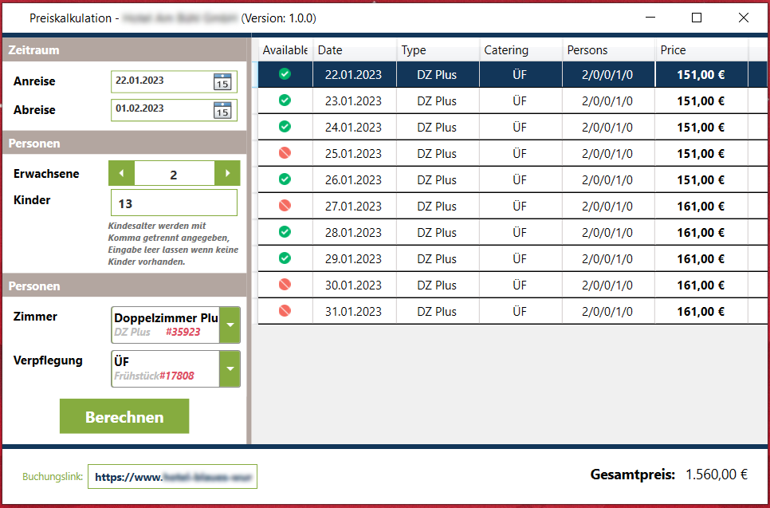

# ViomaRates
Ratenkalender für Vioma, der die Preise für einen Zeitraum anzeigt ohne das Kontigent zu beachten.
Dieses Tool wurde dafür entworfen um vorhandene Preise des Ratenkalenders in Vioma zu sehen, auch wenn alle Zimmer für eine Preiskontrolle ausgebucht wurden.



# Configuration
Die Konfiguration `Settings.ini` der Applikation liegt im Installationsverzeichnis der `.exe`-Datei und kann folgende Werte besitzen:
```
[Endpoint]
ClientID=cst-client-domaon-lopv
BookingPage=https://www.domain.de/path/to/vsc.php

[Hotel]
ID=1234

[User]
Username=<Benutzername>
Password=<Passwort>
```
